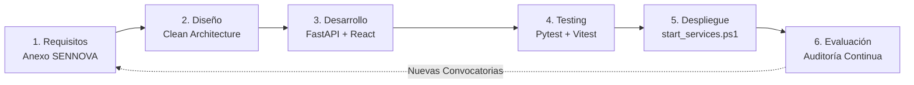
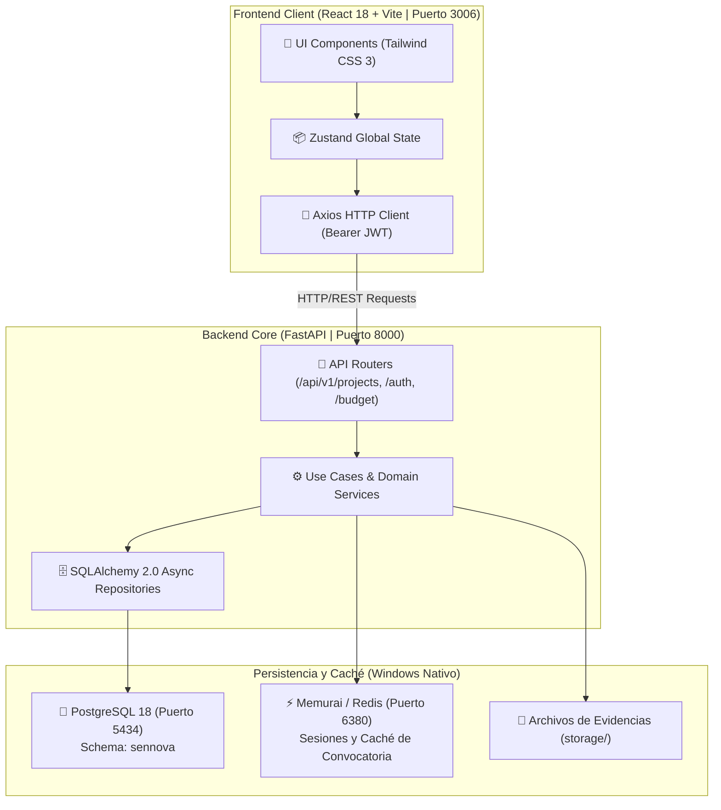
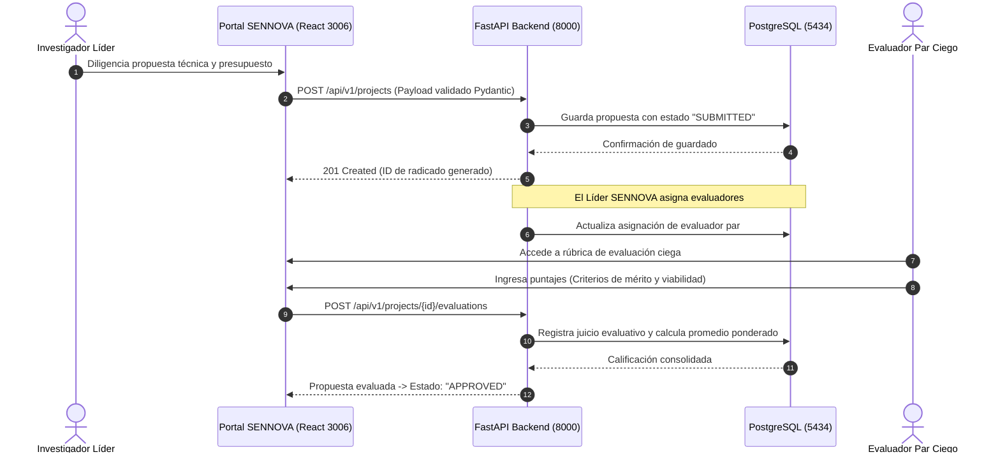
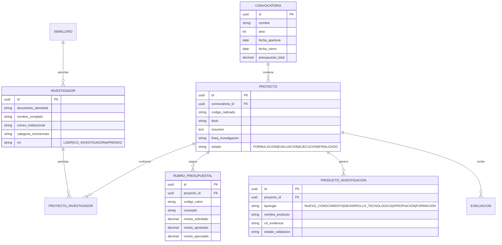

# 🔬 SENNOVA CGAO — Sistema de Gestión de Proyectos de Investigación, Innovación y Desarrollo Tecnológico

[](https://python.org)
[](https://fastapi.tiangolo.com/)
[](https://react.dev/)
[](https://typescriptlang.org/)
[](https://vitejs.dev/)
[-336791?style=for-the-badge&logo=postgresql&logoColor=white)](https://postgresql.org)
[](https://redis.io)
[](https://minciencias.gov.co)
[](https://www.sena.edu.co)

> Plataforma integral de misión crítica para la formulación, evaluación, seguimiento presupuestal, gestión de semilleros y medición de productos de I+D+i en el **Centro de Gestión Agroempresarial del Oriente (CGAO - SENA Vélez)** bajo lineamientos de **SENNOVA** y **MinCiencias Colombia**.

---

## 📋 Tabla de Contenido
- [Visión y Propósito Institucional](#-visión-y-propósito-institucional)
- [Capacidades del Sistema](#-capacidades-del-sistema)
- [Ciclo de Desarrollo del Software (SDLC)](#-ciclo-de-desarrollo-del-software-sdlc)
  - [Fase 1: Análisis de Requisitos y Marco MinCiencias](#fase-1-análisis-de-requisitos-y-marco-minciencias)
  - [Fase 2: Arquitectura del Sistema y Diseño Limpio](#fase-2-arquitectura-del-sistema-y-diseño-limpio)
  - [Fase 3: Implementación y Tecnologías](#fase-3-implementación-y-tecnologías)
  - [Fase 4: Verificación, Pruebas y Aseguramiento de Calidad](#fase-4-verificación-pruebas-y-aseguramiento-de-calidad)
  - [Fase 5: Despliegue y Orquestación Local](#fase-5-despliegue-y-orquestación-local)
  - [Fase 6: Operación Continua y Trazabilidad](#fase-6-operación-continua-y-trazabilidad)
- [Diagramas del Proyecto](#-diagramas-del-proyecto)
  - [Diagrama de Arquitectura Modular](#diagrama-de-arquitectura-modular)
  - [Diagrama de Secuencia: Ciclo de Vida de una Propuesta SENNOVA](#diagrama-de-secuencia-ciclo-de-vida-de-una-propuesta-sennova)
  - [Diagrama Entidad-Relación (ERD de I+D+i)](#diagrama-entidad-relación-erd-de-idi)
- [Estructura del Proyecto](#-estructura-del-proyecto)
- [Guía de Arranque Rápido (Windows Nativo)](#-guía-de-arranque-rápido-windows-nativo)
- [Ejecución de Pruebas](#-ejecución-de-pruebas)
- [Licencia e Información Institucional](#-licencia-e-información-institucional)

---

## 🎯 Visión y Propósito Institucional

El Sistema de Investigación, Innovación y Desarrollo Tecnológico (**SENNOVA**) del SENA tiene como propósito fortalecer los estándares de calidad de la formación profesional integral mediante el fomento de proyectos de investigación aplicada y desarrollo experimental.

La plataforma **SENNOVA CGAO** resuelve los cuellos de botella en la administración de convocatorias anuales:
1. **Estandarización de Propuestas**: Formulación guiada por componentes (árbol de problemas, objetivos, metodología, impactos, presupuesto detallado y cronograma).
2. **Homologación con MinCiencias**: Clasificación estandarizada de productos en las 4 tipologías oficiales (Nuevo Conocimiento, Desarrollo Tecnológico, Apropiación Social y Formación de Talento Humano).
3. **Gestión de Semilleros de Investigación**: Registro de aprendices investigadores, horas dedicadas, asignación de tutores y generación de certificados.
4. **Ejecución Presupuestal**: Monitoreo de desembolsos por rubro SENA (materiales de formación, viáticos, servicios técnicos, equipos).

---

## 🌟 Capacidades del Sistema

- 📑 **Convocatorias y Banco de Proyectos**: Estados de proyecto (*Formulación*, *Evaluación Par*, *Aprobado*, *En Ejecución*, *Cerrado*).
- 👥 **Gestión de Roles y Permisos (RBAC)**: Líder SENNOVA, Investigador Principal, Co-investigador, Evaluador Par y Aprendiz Semillerista.
- 💰 **Matriz Presupuestal Inteligente**: Validación automática de topes presupuestales y rubros financiables según el Anexo Técnico SENNOVA.
- 🎯 **Monitoreo de Hitos y Entregables**: Subida de evidencias documentales (artículos, patentes, prototipos, software, ponencias).
- 📊 **Dashboard Ejecutivo en Tiempo Real**: Métricas de avance financiero vs. avance técnico, cumplimiento de metas e índices de impacto agroindustrial.

---

## 🔄 Ciclo de Desarrollo del Software (SDLC)



### Fase 1: Análisis de Requisitos y Marco MinCiencias
- Levantamiento formal fundamentado en el **Anexo Técnico Nacional SENNOVA**.
- Definición de requisitos funcionales y no funcionales (tiempos de respuesta <150ms, soporte de concurrencia en fechas límite de postulación).
- Autenticación segura mediante JWT con hashing Bcrypt.

### Fase 2: Arquitectura del Sistema y Diseño Limpio
- Desacoplamiento por capas concéntricas (**Clean Architecture**):
  - **Dominio**: Entidades sin dependencias externas (`Project`, `Researcher`, `BudgetRubric`, `ResearchProduct`).
  - **Casos de Uso**: `SubmitProposalUseCase`, `AssignPeerReviewUseCase`, `TrackBudgetExecutionUseCase`.
  - **Infraestructura**: Repositorios SQLAlchemy 2.0 asíncronos y clientes Redis.
  - **Interfaces**: Controladores REST FastAPI documentados con OpenAPI/Swagger.

### Fase 3: Implementación y Tecnologías
- **Backend**: Python 3.11+, FastAPI asíncrono, SQLAlchemy 2.0, Pydantic v2 para validación exhaustiva de esquemas.
- **Frontend**: React 18, Vite, TypeScript, Zustand para gestión de estado global y Tailwind CSS 3.
- **Infraestructura Local**: PostgreSQL 18 nativo en puerto `5434` (schema `sennova`), Memurai/Redis en puerto `6380`.

### Fase 4: Verificación, Pruebas y Aseguramiento de Calidad
- **Pruebas de Backend**: Cobertura >70% con Pytest sobre casos de uso y cálculo financiero de rubros.
- **Pruebas de Frontend**: Vitest para componentes y pruebas unitarias de stores Zustand.
- **Auditoría Continua**: Revisiones periódicas documentadas en `docs/AUDITORIA_SISTEMA.md`.

### Fase 5: Despliegue y Orquestación Local
- Control unificado con `start_services.ps1` y `start_services.bat`.
- Puerto asignado Backend: **8000** | Puerto asignado Frontend: **3006**.

### Fase 6: Operación Continua y Trazabilidad
- Almacenamiento seguro de evidencias en `storage/`.
- Logs centralizados en `logs/` con formato estructurado para depuración rápida.

---

## 📊 Diagramas del Proyecto

### Diagrama de Arquitectura Modular



### Diagrama de Secuencia: Ciclo de Vida de una Propuesta SENNOVA



### Diagrama Entidad-Relación (ERD de I+D+i)



---

## 📂 Estructura del Proyecto

```text
sennova/
├── backend/                  # API REST construida con FastAPI
│   ├── check_users.py        # Script de auditoría de usuarios y permisos
│   ├── run_server.py         # Punto de entrada de Uvicorn (Puerto 8000)
│   ├── seed_dev_users.py     # Carga de datos de prueba para desarrollo
│   └── tests/                # Pruebas de integración y endpoints
├── frontend/                 # Aplicación cliente React + Vite (Puerto 3006)
│   ├── src/
│   │   ├── components/       # Elementos de interfaz de usuario
│   │   ├── pages/            # Vistas principales (Convocatorias, Proyectos)
│   │   ├── store/            # Stores Zustand de estado reactivo
│   │   └── services/         # Clientes de API HTTP
│   └── package.json          # Dependencias y scripts de Vite
├── app/                      # Núcleo modular Clean Architecture
│   ├── application/          # Casos de uso de negocio
│   ├── domain/               # Entidades y reglas de I+D+i
│   ├── infrastructure/       # Repositorios SQLAlchemy y adaptadores
│   └── interfaces/           # Controladores y esquemas
├── docs/                     # Anexos técnicos, guías y auditorías
│   ├── 1MINCIENCIAS/         # Directrices de medición científica
│   ├── 2SENNOVA/             # Formatos oficiales SENA
│   └── SERVICES_README.md    # Manual de orquestación de servicios
├── storage/                  # Repositorio de evidencias y documentos
├── scripts/                  # Automatizaciones de arranque y backup
├── start_services.ps1        # Script canónico de gestión de servicios
└── README.md                 # Este documento
```

---

## 🚀 Guía de Arranque Rápido (Windows Nativo)

### Prerrequisitos
- **Windows 10 / 11** nativo.
- **Python 3.11+** y **Node.js 18+** instalados en PATH.
- **PostgreSQL 18** en puerto `5434` (schema `sennova`).
- **Memurai / Redis** en puerto `6380`.

### 1. Iniciar los Servicios
Desde una consola de PowerShell:

```powershell
# Iniciar backend y frontend en segundo plano
.\start_services.ps1 start
```

### 2. Monitorear el Estado
```powershell
.\start_services.ps1 status
```
- **Backend API**: `http://127.0.0.1:8000`
- **Swagger Docs**: `http://127.0.0.1:8000/docs`
- **Frontend Web**: `http://127.0.0.1:3006`

### 3. Detener los Servicios
```powershell
.\start_services.ps1 stop
```

---

## 🧪 Ejecución de Pruebas

```powershell
# Pruebas unitarias y de integración de Backend
pytest backend/

# Pruebas de Frontend
npm --prefix frontend run test
```

---

## 🏛️ Licencia e Información Institucional

Proyecto desarrollado para el **Servicio Nacional de Aprendizaje (SENA)** — **Centro de Gestión Agroempresarial del Oriente (CGAO)**, Regional Santander.
Desarrollo alineado a la política de software institucional y estándares **DevBrain v8.10**.
