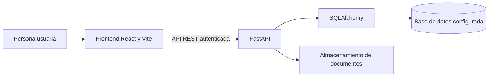

# SENNOVA CGAO

Aplicación para organizar proyectos de investigación del Centro de Gestión Agroempresarial del Oriente. El repositorio contiene un frontend React/Vite y una API FastAPI que administra proyectos, equipos, cronogramas, productos, documentos y reportes.

La documentación CAP-14 recibida se trata como referencia privada del proyecto. Sus diferencias y campos vacíos permanecen pendientes de confirmación; no se usan como valores institucionales generales ni como evidencia de aceptación.

## Funciones presentes en el repositorio

- Registro, edición, consulta e importación revisada de formulaciones de proyectos.
- Asociación de proyectos con responsables, equipos, grupos, semilleros, convocatorias y retos.
- Estructura de investigación: grupo **Investigadores CGAO** → semilleros → investigadores y aprendices → proyectos. Cada proyecto nuevo requiere semillero e investigador responsable de ese semillero; el equipo sólo admite integrantes del mismo semillero.
- Seguimiento de actividades y entregables mediante fechas, responsables y estados.
- Registro de productos de investigación y soportes documentales.
- Construcción, revisión y consulta del expediente documental del proyecto.
- Importación revisada de un ZIP con subcarpetas o de archivos individuales dentro del expediente. Conserva originales, completa campos vacíos reconocidos y permite descargar el paquete o regenerar documentos desde sus formularios.
- Consultas y exportación de reportes consolidados.
- Matriz Excel descriptiva por investigador para revisar productos, categorías registradas y datos pendientes.

La matriz Excel no calcula puntajes ni certifica una clasificación oficial de Minciencias. La aplicación no integra ni reemplaza SENAVANCE. La aplicabilidad de formatos institucionales se debe confirmar con el responsable correspondiente.

## Arquitectura



El esquema vigente, las relaciones y las referencias polimórficas están descritos en [Modelo funcional y de datos](docs/architecture/modelo-funcional-y-datos.md). La API organiza sus rutas por módulos como `/proyectos`, `/entregables`, `/productos`, `/documentos` y `/reportes`.

## Alcance de documentación CAP-14

- [Mapa de fuentes y diferencias](maintenance/project-documentation/reference-map-cap14.md)
- [Trazabilidad de objetivos y protocolo propuesto de pruebas con usuarios](docs/generados-referencias-sennova-2026-10-04/CAP-14-2026-sistema-informacion/trazabilidad_cap14_objetivos.md)
- [Contenido propuesto para revisión](docs/generados-referencias-sennova-2026-10-04/CAP-14-2026-sistema-informacion/contenido_propuesto_cap14.md)
- [Paquete de referencia generado](docs/generados-referencias-sennova-2026-10-04/CAP-14-2026-sistema-informacion.zip)
- [Decisiones de arquitectura](docs/architecture/README.md)

Los borradores no son documentos aprobados ni listos para radicar. El protocolo de pruebas con usuarios requiere definir participantes, perfiles, ambiente y criterios antes de registrar resultados.

## Carga de archivos del proyecto

En **Expediente del proyecto → Importar archivos al proyecto**, seleccione un ZIP o archivos individuales. Revise la clasificación, los datos propuestos y los bimestres antes de guardar. La importación conserva los valores existentes e informa sus diferencias con los archivos. En **Documentación**, complete los pendientes y genere nuevas versiones; las descargas individuales y el ZIP incluyen los originales disponibles.

La lectura automática reconoce DOCX, XLSX, PPTX, TXT, CSV y MD con rótulos compatibles con los formularios. Los PDF, imágenes, audio, video y formatos binarios anteriores se conservan como soportes; no se realiza OCR. Los manifiestos JSON se conservan como archivos y no se interpretan como órdenes ni como campos del proyecto.

Límites por carga: un ZIP de 50 MB, hasta 500 archivos, 10 MB por archivo y 200 MB descomprimidos o en conjunto. Se admiten paquetes parciales y se informan las carpetas pendientes. Una repetición del mismo archivo y ruta no duplica el original; si su contenido cambia, se conservan ambas copias. Consulte [el contrato de importación](docs/architecture/importacion-expediente.md).

## Datos heredados retirados

La función de bitácoras y los formatos de seguimiento de etapa productiva se retiraron del sistema. En el siguiente arranque de la API, la migración elimina la tabla antigua `bitacora_entries`, las columnas `formato_bitacora_path` y `formato_seguimiento_path`, los documentos y notificaciones asociados y los archivos exclusivos referenciados, siempre dentro del almacenamiento configurado. Conserva los registros generales `actividades` y `audit_logs`, los documentos del proyecto y el campo legado `informe_final_path`.

## Verificación

Las pruebas y compuertas de cobertura que ejecuta la integración continua están definidas en [`.github/workflows/ci.yml`](.github/workflows/ci.yml). Los comandos principales son:

```powershell
Set-Location backend
python -m pytest tests/ -q
Set-Location ../frontend
npm test
npm run build
```

Para consultar requisitos de inicialización y despliegue, revise [Datos obligatorios del primer despliegue](docs/architecture/bootstrap-despliegue-inicial.md). No use datos personales reales en pruebas sin autorización institucional.
