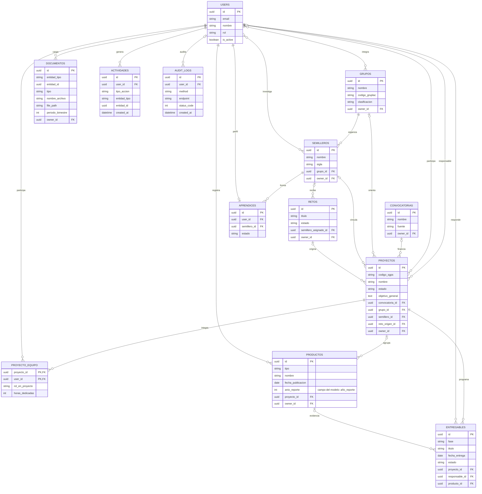

# Modelo funcional y de datos de SENNOVA CGAO

**Estado:** descripción técnica derivada del modelo y las rutas de la aplicación. No representa un diseño aprobado por el equipo de CAP-14 ni fija requisitos institucionales.

**Actualizado:** 5 de octubre de 2026.

## Alcance funcional observado

| Módulo | Responsabilidad comprobable | Componentes principales |
|---|---|---|
| Proyectos | Registrar proyectos de investigación, objetivos, estado, responsables y relaciones institucionales. | `frontend/src/components/projects/ProyectosModule.jsx`; `backend/app/routers/proyectos.py` |
| Cronogramas y entregables | Asociar tareas, fechas, responsables, estado y, cuando aplica, un producto al proyecto. | `frontend/src/components/deliverables/CronogramaModule.jsx`; `backend/app/routers/entregables.py` |
| Productos | Registrar productos, investigador responsable, evidencia y proyecto relacionado. | `frontend/src/components/products/ProductosModule.jsx`; `backend/app/routers/productos_query.py`; `backend/app/routers/productos_commands.py` |
| Documentación y evidencias | Cargar, consultar, revisar y descargar documentos asociados al proyecto, producto o usuario. | `frontend/src/components/projects/ProjectDocumentationEditor.jsx`; `backend/app/routers/project_documentation.py`; `backend/app/routers/documentos.py` |
| Consultas e indicadores | Consultar consolidados de proyectos, grupos, productos, semilleros y talento; descargar la matriz descriptiva de indicadores. | `frontend/src/components/reports/ReportesModule.jsx`; `backend/app/routers/reportes.py`; `backend/app/services/minciencias_indicator_workbook.py` |
| Estructura de investigación | Mantener usuarios, grupos, semilleros, convocatorias y retos relacionados con los proyectos. | Modelos correspondientes en `backend/app/models.py`; routers por módulo en `backend/app/routers/` |

Este mapa refleja componentes encontrados en el repositorio. La lista de perfiles, permisos, aprobadores, integraciones y criterios de aceptación de CAP-14 requiere confirmación del equipo del proyecto.

## Modelo de datos

El siguiente diagrama resume las claves foráneas declaradas en `backend/app/models.py`. `DOCUMENTOS.entidad_tipo` y `DOCUMENTOS.entidad_id` forman una referencia polimórfica y no una clave foránea. El diagrama se limita a las entidades que dan soporte directo a la gestión de investigación.

### Notas de lectura

- `PROYECTO_EQUIPO`, `GRUPO_INTEGRANTES` y `SEMILLERO_INVESTIGADORES` son tablas de asociación. El diagrama muestra las dos últimas como relaciones muchos-a-muchos para facilitar la lectura.
- La base de datos heredada permite que proyectos anteriores no tengan semillero. La API exige un semillero para cada proyecto nuevo, asigna un investigador vinculado a ese semillero como responsable y hereda de allí el único grupo institucional, **Investigadores CGAO**. Los cambios de semillero también validan al responsable y al equipo antes de guardar.
- Los investigadores se relacionan con semilleros mediante `SEMILLERO_INVESTIGADORES`; cada perfil de aprendiz tiene un semillero en `APRENDICES`. El equipo del proyecto sólo admite investigadores y aprendices que pertenecen al semillero seleccionado.
- Convocatoria, reto, productos y algunos responsables de entregables siguen siendo opcionales cuando el modelo y el proceso documental no exigen el dato.
- `DOCUMENTOS.entidad_id` puede apuntar a distintos tipos de entidad y no tiene integridad referencial declarada por base de datos. La API valida el destino y los permisos.
- `ACTIVIDADES` y `AUDIT_LOGS` son registros técnicos de uso y auditoría. No representan una bitácora narrativa del proyecto.
- Los informes finales hacen parte de la documentación de proyectos. Los documentos nuevos se gestionan en `DOCUMENTOS`; `proyectos.informe_final_path` se conserva como campo heredado.

El diagrama muestra nulabilidad física del esquema, que conserva datos históricos. La regla vigente de la API es más estricta para crear proyectos y cambiar sus vínculos.

## Retiro de la función ajena de bitácora

La función de bitácoras y los formatos de seguimiento de etapa productiva no hacen parte del alcance confirmado de CAP-14. El modelo vigente ya no registra `BitacoraEntry` ni define `formato_bitacora_path` o `formato_seguimiento_path`. La inicialización elimina la tabla y los campos heredados, los documentos y las notificaciones de bitácora, y los archivos exclusivos ubicados dentro del almacenamiento configurado. Conserva la auditoría general, la actividad y los documentos de proyectos.

La migración de arranque también elimina documentos y notificaciones asociados a bitácoras. Borra archivos sólo cuando están dentro del almacenamiento configurado y no los comparte otra fila documental. Las cargas nuevas del antiguo tipo `evidencia_bitacora` se rechazan; la actividad y auditoría generales se conservan.

## Dinámica recomendada para los proyectos

- El registro comienza con la selección del semillero y de un investigador responsable que ya pertenezca a él. El responsable puede incorporar aprendices del mismo semillero como apoyos y asignarles tareas concretas.
- Cada tarea debe indicar resultado esperado, persona responsable y fecha acordada. El investigador revisa los aportes y orienta correcciones antes de aceptar una entrega o incorporarla al expediente.
- Los documentos se cargan en la carpeta correspondiente del expediente. Conviene acordar una persona revisora, estado y fecha de revisión para cada archivo; la aplicación conserva las versiones generadas, pero las aprobaciones, firmas y radicación se deben tramitar por el canal institucional confirmado.
- Si una persona cambia de semillero, primero se reasignan sus proyectos, tareas y apoyos. La aplicación no debe cambiar el semillero de un proyecto mientras su responsable o equipo siga vinculado únicamente al anterior.

La aplicación ya valida el semillero, el investigador responsable y la pertenencia del equipo. Quedan por confirmar con el equipo institucional las reglas de revisión, aprobación, firma, frecuencia de reunión y tiempos de respuesta; no se fijan como requisitos del sistema sin esa decisión.

## Confirmaciones pendientes

Antes de declarar terminado el diseño de CAP-14, el equipo debe validar el modelo frente a los requisitos aprobados, los perfiles y permisos, las reglas de revisión, los periodos de informes, la edición aplicable de Minciencias y cualquier integración externa requerida. Este documento describe la aplicación actual y no sustituye esa revisión.
